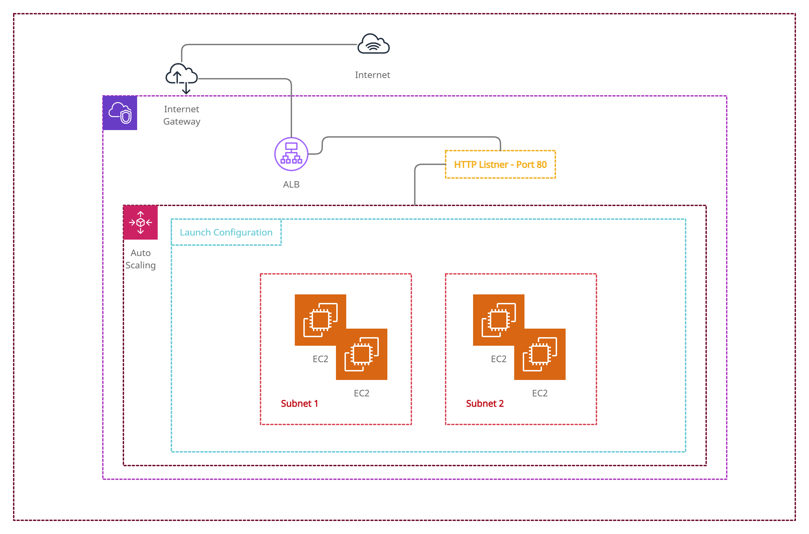

# Amazon Web Services - CloudFormation Introduction
Introduction to AWS CloudFormation

Learn how to use CloudFormation, the AWS approach to automating the management of complex infrastructure and environments in a safe, reliable and repeatable manner.

# What is CloudFormation

CloudFormation is an Infrastructure as Code toll for AWS and designed for AWS. It's free but underlying resources will be changed as provisioned. you can use YAML or JSON to build the template.

<h2>This Repository Includes below CloudFormation Templates</h2>

<ol>
   <li>Introduction CloudFormation Sample Template</li>
   <li>Intrinsic Function</li>
   <li>Creating multiple resources in cloudformation</li>
   <li>Pseudo paramaters in CloudFormation</li>
   <li>Mapping in cloudformation</li>
   <li>Input Parameters in cloudformation</li>
   <li>Outputs in CloudFormation</li>
   <li>Userdata in CloudFormation</li>
   <li>Helper script in CloudFormation</lai>
   <li>Change set script cloudformation - Sample Template</li>
   <li>Change set script cloudformation - Change set example 1</li>
   <li>Change set script cloudformation - Change set example 2</li>
   <li>Fullstack Cloudformation Template</li>
</ol>

                Create                            Provision
[Template] -------------> [CloudFormation] ------------------> [CloudFormation Stack]

<h3>YAML Format Example:</h3>
<pre>
<code>
AWSTemplateVersion: "2010-09-09"
Description: String Description
Resources:
   LogicalName-Resources:
      Type: AWS::EC2::Instance
      Properties:
         InstanceId: AMI-Id
         InstanceType: t2.micro

</code>
</pre>

<h3>JSON Format Example:</h3>
<pre >
<code>
{
   "AWSTemplateVersion: "2010-09-09",
   "Description" : "JSON String",
   "Resources": { set of resources}
}
</code>

</pre>

To download latest Repo Please <a href="https://github.com/cloudxperts/aws-cloud-formation-intro/archive/main.zip">Click Here..</a>

